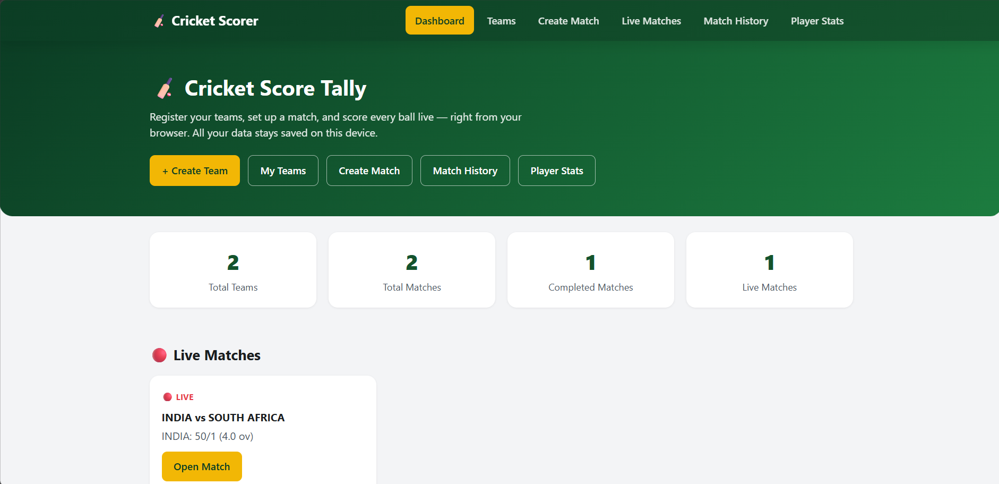
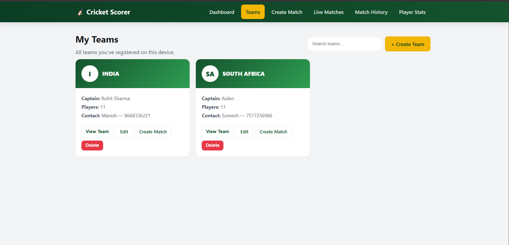
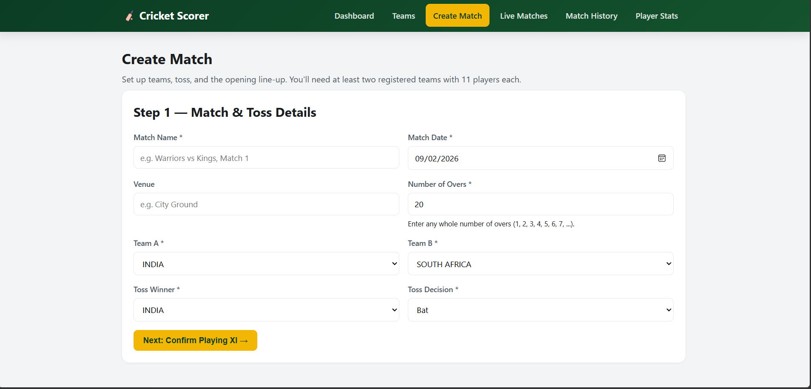
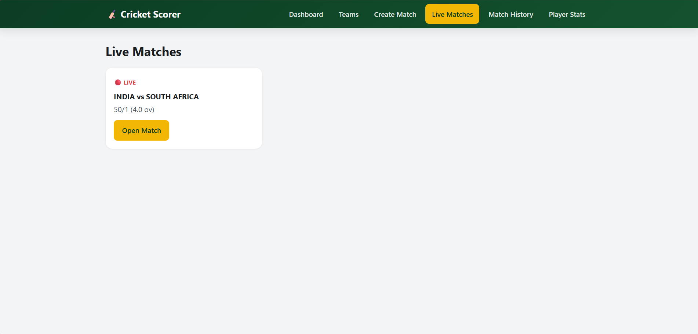
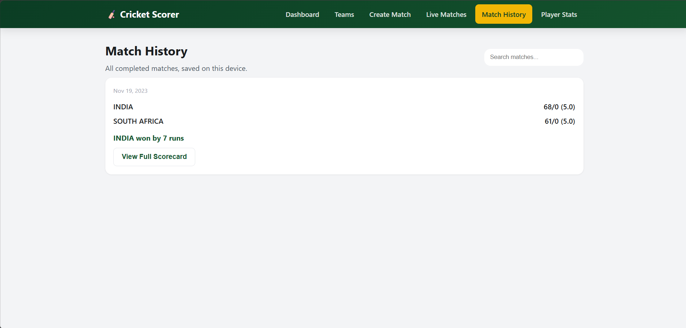
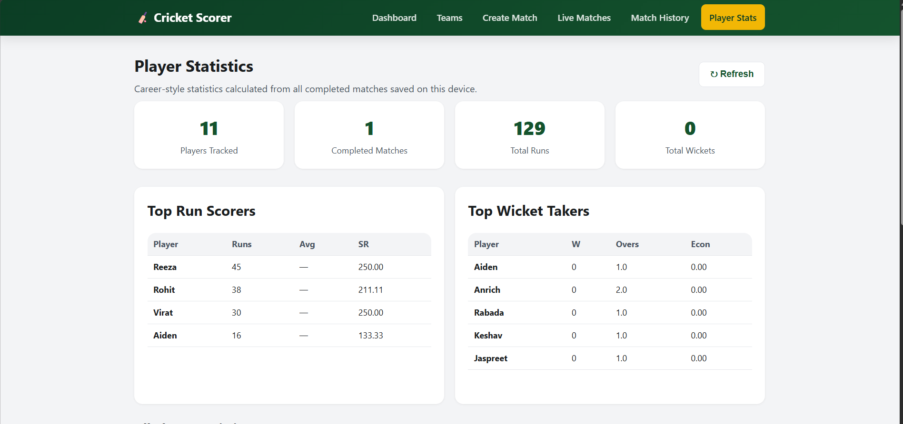
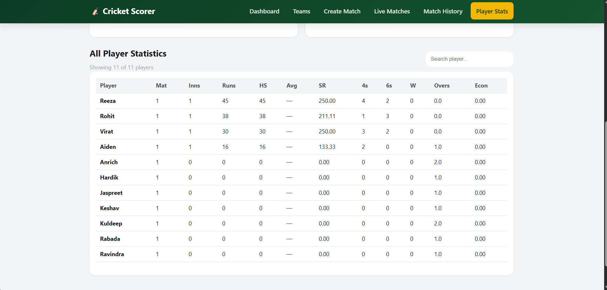

# 🏏 CricScoreX

A browser-based cricket scoring and statistics application built entirely with **HTML, CSS, and Vanilla JavaScript**.

The application allows users to register cricket teams, select a Playing XI, create matches, score every ball live, maintain batting and bowling scorecards, save completed matches, and view player statistics.

## ✨ Features

### Team Management
- Create and edit cricket teams
- Store team name, city, captain, vice-captain and contact details
- Register **11–15 players** per squad
- Assign player roles, jersey numbers, captain/vice-captain and wicketkeeper
- Optional team logo

### Match Management
- Create matches between registered teams
- Select match date, venue and overs
- Toss winner and decision tracking
- Select an exact **Playing XI of 11 players** from each squad
- Select opening batsmen and opening bowler

### Live Ball-by-Ball Scoring
- Runs: 0, 1, 2, 3, 4, 5, 6
- Extras: Wide, No Ball, Bye, Leg Bye
- Wicket recording with dismissal type and dismissed batsman
- Undo last scoring action
- End-over handling
- Automatic strike rotation
- Bowler rotation validation
- Current-over ball display
- Partnership and fall-of-wicket information
- Target, required run rate and balls remaining during the chase

### Match History
- Completed matches saved locally
- Match result summary
- Full batting and bowling scorecards
- Extras and fall of wickets
- Search/filter completed matches
- Print-friendly scorecard

### Player Statistics
- Total runs, wickets and matches
- Highest score
- Batting average
- Strike rate
- Boundaries (4s/6s)
- Overs bowled
- Economy rate
- Top run scorers
- Top wicket takers
- Searchable player statistics
- Player profile/statistics view

## 🛠️ Technology Stack

| Technology | Purpose |
|---|---|
| HTML5 | Page structure and forms |
| CSS3 | Responsive UI and styling |
| Vanilla JavaScript | Application logic and scoring engine |
| LocalStorage | Persistent browser-side data storage |

No backend, database, framework, or external JavaScript library is required.

## 📁 Project Structure

```text
cricket-scorer/
│
├── index.html
├── create-team.html
├── teams.html
├── create-match.html
├── live-match.html
├── match-history.html
├── player-stats.html
│
├── css/
│   └── style.css
│
├── js/
│   ├── app.js
│   ├── storage.js
│   ├── teams.js
│   ├── match.js
│   ├── scoring.js
│   ├── history.js
│   └── stats.js
│
├── docs/
│   ├── DEPLOYMENT.md
│   ├── PROJECT_REPORT.md
│   └── TESTING.md
│
├── screenshots/
├── .gitignore
├── LICENSE
└── README.md
```

## 🖼️ Screenshots

The following screenshots demonstrate the main features and user interface of the CricScoreX application.

### 🏠 Dashboard

The dashboard provides a quick overview of registered teams, matches, completed matches, and currently live matches.




### 👥 Teams

The Teams page allows users to view and manage their registered cricket teams.




### 🏏 Create Match

The Create Match page allows users to configure a match, select teams, set the number of overs, configure the toss, and confirm the Playing XI.




### 🔴 Live Matches

The Live Matches page displays all currently active matches and allows users to open a match and continue live scoring.




### 📋 Match History

The Match History page displays completed matches along with their results and provides access to detailed scorecards.




### 📊 Player Statistics

The Player Statistics page provides career-style statistics calculated from completed matches, including runs, strike rate, wickets, overs, and economy.

#### Top Player Statistics



#### Complete Player Statistics


## 🧠 Application Architecture

The JavaScript code is separated by responsibility:

- `storage.js` — LocalStorage CRUD and persistence
- `teams.js` — Team creation, editing and validation
- `match.js` — Match setup, Playing XI and innings initialization
- `scoring.js` — Ball-by-ball scoring rules and calculations
- `history.js` — Match history and scorecard rendering
- `stats.js` — Player statistics aggregation
- `app.js` — Shared navigation and dashboard bootstrapping

This modular structure keeps the scoring engine separate from the user interface and storage layer.

## 💾 Data Storage

The project is intentionally backend-free. Data is stored in the browser using LocalStorage.

Main storage collections:

```text
cst_teams
cst_matches
```

Because data is stored locally, the application can work without an internet connection after the files have been loaded in the browser.

## 🚀 Run Locally

### Option 1 — Open directly

Open `index.html` in a modern browser.

### Option 2 — VS Code Live Server

1. Open the project folder in VS Code.
2. Install the **Live Server** extension.
3. Right-click `index.html`.
4. Select **Open with Live Server**.

Using a local server is recommended while developing.

## 🌐 Deployment

This is a static website, so it can be deployed without a backend.

Recommended options:

- GitHub Pages
- Netlify
- Vercel static deployment

See `docs/DEPLOYMENT.md` for step-by-step instructions.

## 🧪 Testing Checklist

Before publishing, test:

- [ ] Create a team with 11 players
- [ ] Create a squad with 12–15 players
- [ ] Select exactly 11 players for a Playing XI
- [ ] Create a match
- [ ] Record normal runs
- [ ] Record wides and no-balls
- [ ] Record byes and leg-byes
- [ ] Record wickets
- [ ] Test Undo
- [ ] Complete an over and change bowler
- [ ] Complete both innings
- [ ] Open Match History
- [ ] Open the full scorecard
- [ ] Print a scorecard
- [ ] Open Player Stats
- [ ] Search for a player
- [ ] Open a player profile
- [ ] Test navigation on mobile width

## 🔒 Important LocalStorage Note

Clearing the browser's site data will remove teams and matches stored by this application. The project does not send these records to a server.

## 📌 Future Enhancements

Potential next versions could add:

- Export scorecard as PDF/CSV
- Shareable scorecard links
- Tournament/league management
- Team-wise statistics
- Player career history
- Advanced charts
- Dark mode
- PWA/offline installation support
- Optional cloud database and authentication

## 👨‍💻 Portfolio Description

**Cricket Scorer — Browser-Based Cricket Scoring & Statistics System**

Developed a responsive cricket scoring application using HTML5, CSS3 and Vanilla JavaScript. Implemented ball-by-ball scoring, extras, wickets, Playing XI selection, strike/bowler management, match history, full scorecards and player statistics using modular JavaScript and LocalStorage for client-side persistence.

## 📄 License

This project is available under the MIT License. See `LICENSE`.
